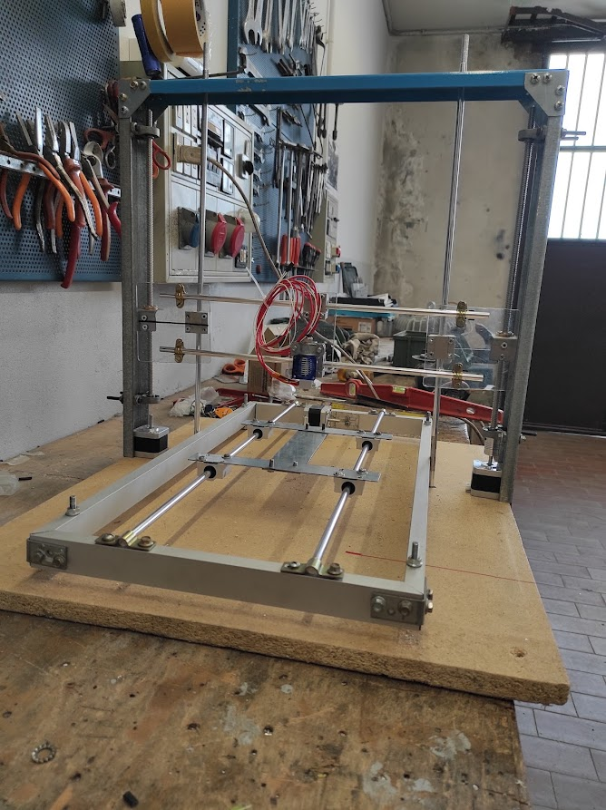
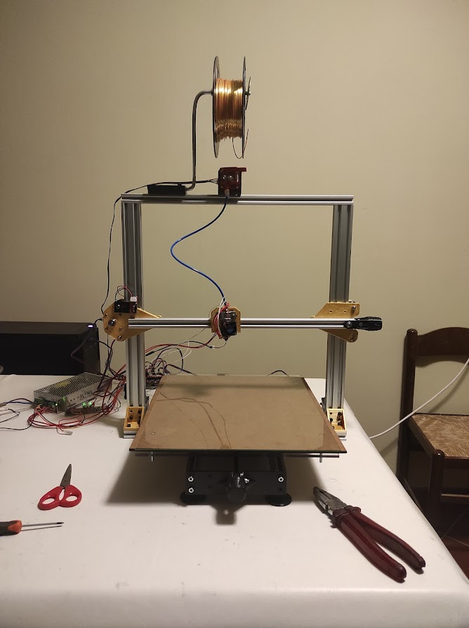
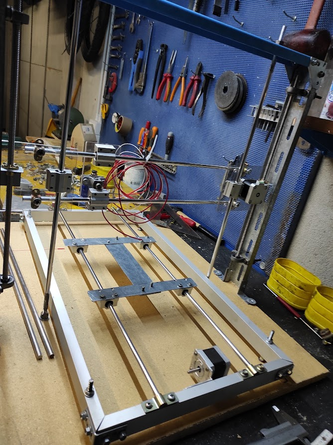
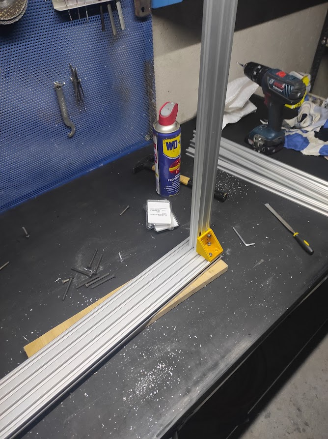
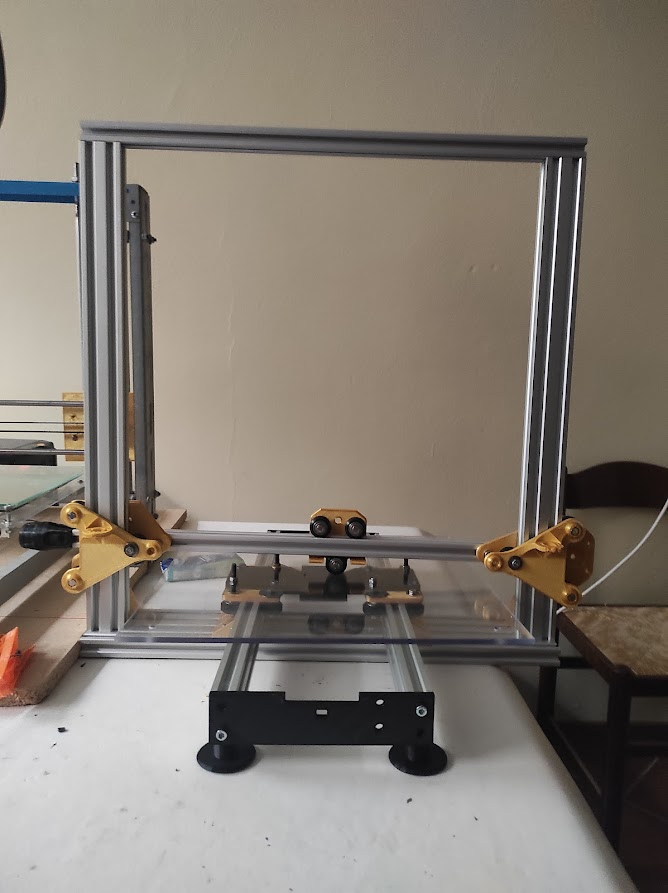

# DIY 3D Printer Project

## Description
In this project, I built a **3D printer from scratch**, starting with easily accessible materials and later developing a **second, larger, and more robust version**.  
The project required **electronics, mechanics, and programming** skills, as well as **problem-solving and prototyping abilities**.

## Components Used

### Electronics
- **Mega 2560 R3 CH340** (Microcontroller)
- **RAMPS 1.4 Controller** (Motor and heating control board)
- **5x A4988/DRV8825** (Stepper Driver Modules)
- **12864 Display** (For printer control)
- **Nema 17 Stepper Motors**

### Software
- **Firmware:** Marlin installed on Arduino
- **Design & Prototyping:** Fusion 360
- **Slicing & G-Code Generation:** Cura

## Build Process

### First Version
- Built using easily accessible materials.
- Used to print parts necessary for the second version.

### Second Version
- Constructed with **V-slot aluminum profiles**.
- Motion axes built using **wheels compatible with the profile slot**.
- **Work area:** 40x40x40 cm.

## Technologies & Methods Used
- **CAD Design:** Modeled and simulated components using Fusion 360.
- **Iterative Prototyping:** The first printer was used to produce improved components for the second version.
- **Manual Assembly:** Built and assembled all electronic and mechanical parts.
- **Firmware Optimization:** Custom Marlin configurations for the printer’s specifications.

## Included Files
The `3D/` folder contains **STL files** for some components of the second printer, entirely designed and manufactured by me.

## Project Images
Images should be placed in the `images/` folder and linked within the README for better documentation.

### Suggested Image Structure:
  
- **FirstVersionChassis:**
  
   
    
- **Assembly:**
  
   
  
- **SecondVersionChassis:**
  
   
  
## Author
**Andrea Bolis**
